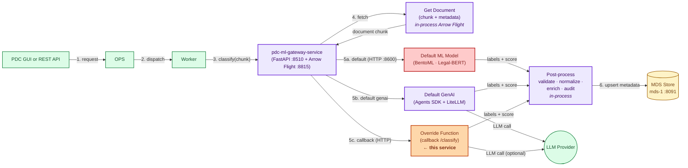
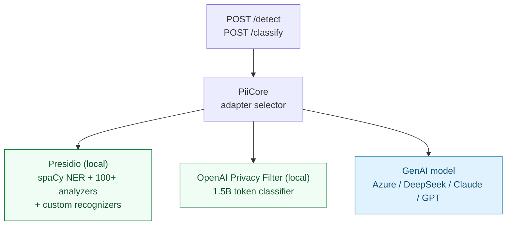
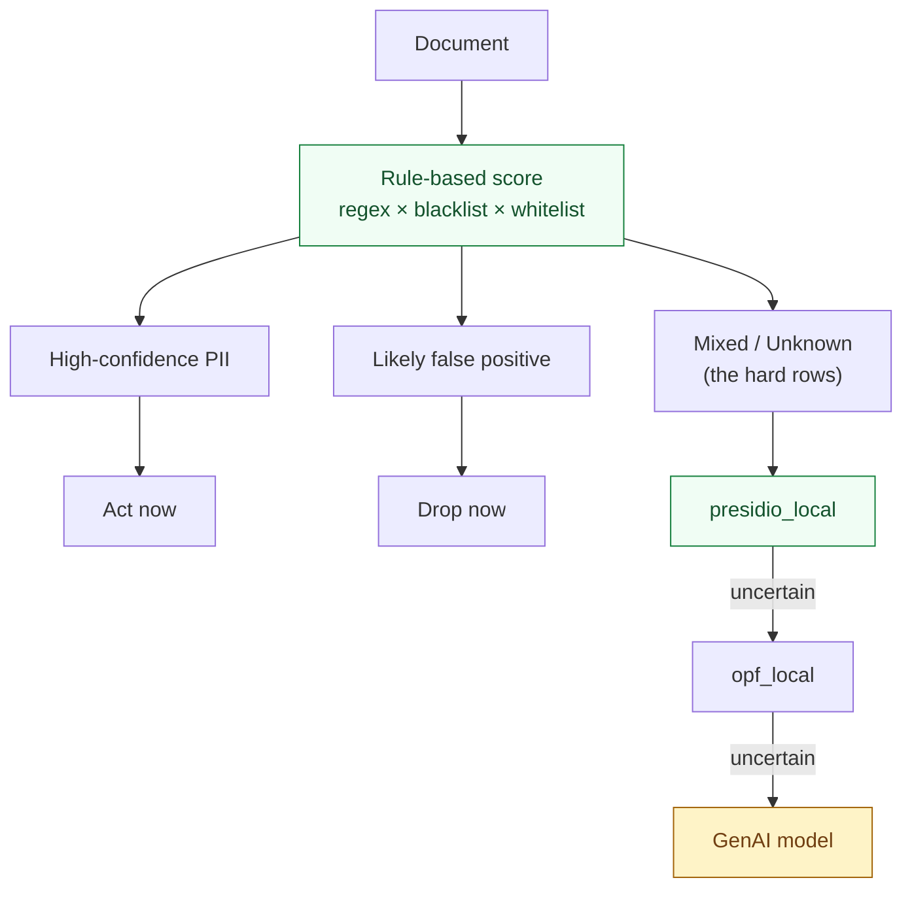
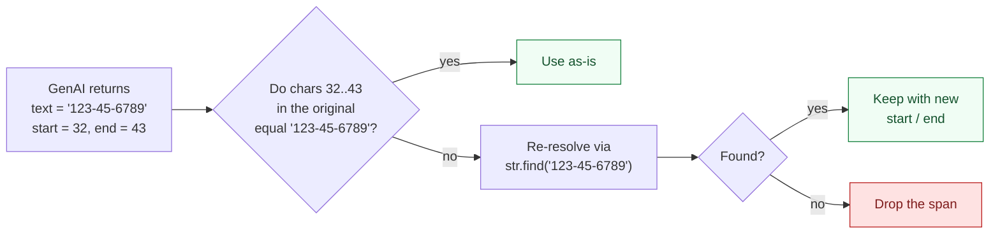

# AI/ML based NPI/PII Detection in Unstructured Documents — Context-Aware Disambiguation

## Background

The earlier guide, *NPI Detection in Unstructured Documents — A Practical
Guide*, walked through detecting NPI/PII in unstructured documents using
**regex pattern matching** and **dictionary-based scoring** — a simple
format regex, then a context-aware regex with negative lookaheads, and
finally a multi-signal decision matrix combining regex frequency, blacklist
hits, and whitelist hits. SSN was the running example, but the technique
applies to **any NPI/PII** category — names, dates of birth, email
addresses, phone numbers, EINs, ITINs, credit-card numbers, account
numbers, medical record IDs, government IDs, and so on. That approach is cheap, deterministic, and
remains a sound first-pass technique.

It also has structural limits that no amount of pattern tuning can resolve:

1. **Chunk isolation** — a chunk is evaluated alone, with no knowledge of
   the document around it.
2. **Position blindness** — dictionary matching returns frequency only, not
   location.
3. **Co-location vulnerability** — a whitelisted label and a real PII value
   landing together in the same chunk shield each other.
4. **Shape over meaning** — `123-45-6789` next to "Reference Number" is
   indistinguishable from the same digits next to "Taxpayer ID". A regex
   matches the format; it does not understand the sentence.

This document addresses limit (4) head-on through **contextual
disambiguation** — the AI/ML term for resolving the meaning of an
ambiguous token from the surrounding sentence. The work is performed by
a full **AI/ML stack**, not a single technique and certainly not a
pattern engine. Three model families participate, each with different
strengths:

- **NLP / Named-Entity Recognition (NER)** — statistical or neural
  taggers (e.g. spaCy + Microsoft Presidio) that label spans with entity
  types from surrounding linguistic context. Fast, deterministic,
  inexpensive.
- **Traditional ML — custom-trained classifiers** — token classifiers
  and sequence taggers fine-tuned on a domain corpus (e.g. the OpenAI
  Privacy Filter, a 1.5B-parameter on-prem model). Strong on the
  patterns they were trained for; updated by retraining.
- **GenAI — large language models** — instruction-following models
  (Azure OpenAI, Claude, DeepSeek, GPT) that reason over the sentence
  and respond to prompts. Most flexible; highest latency and cost.

None of the three is a silver bullet. Effective contextual
disambiguation comes from **combining** them — and combining them with
the earlier rule-based score, which is **not discarded**. Rules remain a
cheap first pass and an effective router into the model tier.

The same SSN test corpus introduced in the earlier guide is reused
throughout — SSN remains a convenient running example because the formats
are well known and the false-positive surface is rich — but the same code
paths apply unchanged to every other NPI/PII category covered by the
recognizer set.

> **This is a separate pipeline.** The reference implementation described
> here is a standalone NPI/PII detection service intended to be plugged
> into Pentaho Data Catalog (PDC) as a **custom AI/ML implementation
> override**. Its architecture, configuration, adapter pattern,
> request/response envelopes, API catalogue, and synthetic test fixtures
> are documented in detail in
> [01 — Overview](./01-overview.md) ·
> [02 — Architecture](./02-architecture.md) ·
> [03 — Configuration](./03-configuration.md) ·
> [04 — API Reference](./04-api-reference.md) ·
> [05 — Adapter Mindmap](./05-adapter-mindmap.md) ·
> [06 — Test Dataset](./06-test-dataset.md). This document focuses on the
> AI/ML question — *how does a model resolve the same ambiguity that rules
> cannot?*

---

## Technical Highlights of the Reference Implementation

A **near production-grade** reference implementation accompanies this
document. It is purpose-built to plug into **Pentaho Data Catalog (PDC)** as
a **custom AI/ML implementation override** for NPI/PII detection — exposed
through the orange *Override Function* path in the PDC ML Gateway
architecture (see *Pipeline Anatomy*). Use it **as-is** for production
override, or treat it as a **reference implementation** for your own
build. It already follows the AI/ML best practices listed later in this
document.

- **Classify and detect endpoints.** `POST /detect` and the
  gateway-compatible alias `POST /classify` accept the **fully extracted
  document text** (OCR or Tika output) and return typed entity spans
  (`PERSON`, `EMAIL_ADDRESS`, `PHONE_NUMBER`, `DATE_OF_BIRTH`, `URL`,
  `ACCOUNT_NUMBER`, `US_SSN`, …) with character offsets and per-entity
  confidence.
- **Whole-document input by default.** This service does not chunk. It
  receives the document in full and lets the caller decide whether to chunk
  — see *Best Practices*.
- **Three pluggable AI/ML adapter families** behind one
  `PiiDetectionAdapter` interface:
  - **Microsoft Presidio (local)** — production-grade open-source NER stack
    with **100+ built-in analyzers** spanning SSN, credit card, IBAN,
    email, phone, IP, medical licence, US driver's licence, UK NHS, AU
    ABN, IN AADHAAR, SG NRIC, and many more — and **fully extensible** via
    custom `EntityRecognizer` subclasses, `PatternRecognizer` regex packs,
    or deny-lists.
  - **OpenAI Privacy Filter (OPF, local)** — 1.5B-parameter on-prem token
    classifier; no network call at inference.
  - **GenAI model** — single adapter that targets any OpenAI-compatible
    endpoint (Azure APIM, DeepSeek, Anthropic Claude, OpenAI GPT). New
    providers are configuration, not code.
- **Configuration-only backend switching.** The active model family is
  selected by one YAML key. No restart, no code change, no redeploy.
- **Hot-reload of configuration and secrets** on the next request after the
  file changes on disk.
- **Hallucinated-offset protection.** Every span returned by a GenAI model
  is re-resolved against the original text and dropped if it cannot be
  found there. See the explanation in *Known Limitations*.
- **Single, framework-agnostic core (`PiiCore`)** orchestrates detection
  across all backends. The HTTP layer is a thin wrapper; the same core is
  callable from notebooks, batch jobs, or any Python process.
- **Bonus — Agentic automatic model evaluator (`agents/`).** A
  markdown-defined **orchestrator Agent** delegates to **multiple
  Sub-Agents** (one per adapter variation, plus a reporter Sub-Agent). The
  Sub-Agents run the test corpus **in parallel**, capture precision, recall,
  latency, and token cost, and the reporter compiles a side-by-side report.
  This pattern — automated, agent-driven model evaluation — is one of the
  most important and recommended practices in production AI/ML, and is
  shipped as bonus code that customers can adapt to their own corpora.
- **Token accounting on every response.** Upstream `usage` blocks are
  passed through when the provider returns them; otherwise estimated
  locally. A YAML rate card converts tokens to dollars.
- **Synthetic test corpus, no real PII.** All fixtures — single-line text
  cases and the 13 SSN PDFs — are hand-constructed and safe to commit.
- **Detection is the focus.** Redaction is downstream policy.

> **About redaction.** The service also exposes `POST /redact` and
> `POST /detect-redact`, which use the Presidio anonymizer. Redaction is
> downstream policy and not part of the disambiguation question this
> document addresses.

---

## How Contextual Disambiguation Differs from Context-Aware Regex

The earlier guide used "context-aware" to mean *lexical context* — a regex
that refuses to match if a specific phrase occurs in the same chunk. That is
a string-level trick.

**Contextual disambiguation** in the AI/ML sense uses *semantic context* —
the model reads the sentence around a candidate token and assigns a label
based on what the surrounding words **mean**, not just what they spell.

| Aspect | Lexical (rule-based) | Semantic (AI/ML-based) |
|---|---|---|
| Signal source | Regex match + dictionary frequency | NER model or GenAI model over the sentence |
| Context window | A chunk; word order ignored | Whole sentence; word order preserved |
| Unseen labels | Must be added to whitelist explicitly | Generalises from training data |
| Failure mode | Co-location vulnerability | Hallucinated spans, label drift across model versions |
| Cost | Near-zero, deterministic | Latency + (sometimes) per-token charge |
| Determinism | Yes | Strong with temperature 0 + offset re-resolution |

The two approaches handle different failure modes. The strongest pipelines
run both.

---

## Pipeline Anatomy — Where This Service Plugs Into PDC

In the PDC ML Gateway, every classification request is routed to **one of
three engines**: the default ML model (BentoML / Legal-BERT in AI Fusion),
the default GenAI path (OpenAI Agents SDK + LiteLLM, in-process in the
gateway), or a customer-supplied **Override Function** invoked over HTTP.

The NPI/PII detection service in this repository is designed to be
deployed as that **Override Function** — the orange node below.
Everything around it (PDC GUI, OPS, Worker, Arrow Flight content fetch,
post-process, MDS upsert) is the existing PDC pipeline and is unchanged.



- 🟧 **Orange — Override Function = this NPI/PII detection service.** The
  gateway invokes it as a callback (`POST /classify`) once the document
  chunk has been fetched. The override returns labels + scores in the same
  envelope as the default engines. No changes to PDC are needed beyond
  configuring the override URL.
- 🟪 **Purple — gateway-hosted pipeline.** Document fetch (Arrow Flight),
  default GenAI engine, and post-process all run inside
  `pdc-ml-gateway-service-1`.
- 🟥 **Red — default ML model** (Legal-BERT on BentoML inside AI Fusion) is
  PDC's out-of-the-box engine. The override coexists with it; PDC picks
  which engine handles a given request.
- 🟨 **Yellow — MDS** stores the enriched metadata.
- 🟩 **Green — actors and external SaaS** (PDC GUI, OPS dispatcher, Worker,
  LLM provider).

**The override receives the full extracted document chunk** as text and
returns labels with offsets. It does not chunk further; chunking remains
the caller's decision (see *Best Practices*). The earlier rule-based
score can still be applied — inside the override it makes an excellent
cheap router into the AI/ML tier (see *Hybrid Pattern*).

> The full PDC ML architecture (C4 levels, runtime sequence, container
> topology, Arrow Flight content lifecycle, custom-override integration
> guide) is documented separately in the PDC ML Gateway docs under
> `02-genai-ml-in-pdc/`. This page only shows the slice relevant to
> dropping the override into place.

---

## Three AI/ML Model Families, One Interface



| Family | Backend key | Strategy | Network | GPU |
|---|---|---|---|---|
| **Microsoft Presidio (local)** | `presidio_local` | spaCy NER + 100+ analyzers + custom recognizers | None | No |
| **OPF token classifier (local)** | `opf_local` | OpenAI Privacy Filter 1.5B token classifier | None | Optional |
| **GenAI model** | `piidetect_with_genai` | OpenAI-compatible endpoint (Azure / DeepSeek / Claude / GPT) | Yes | No (server-side) |

All three implement the same interface. Switching is one YAML key.

### Why Presidio Stands Out

Presidio is open source, locally deployable, and ships with **100+ analyzers**
spanning generic PII (person, email, phone, IP, URL), financial identifiers
(credit card, IBAN, US bank routing), and government identifiers across many
jurisdictions (US SSN, US ITIN, UK NHS, AU ABN, IN AADHAAR, SG NRIC, etc.).

Equally important, Presidio is **extensible by design**. New recognizers are
added by:

- subclassing `EntityRecognizer` for full programmatic control, or
- registering a `PatternRecognizer` with one or more regexes plus a
  context-word list, or
- shipping a YAML / JSON deny-list and loading it via the recognizer
  registry.

This means the rule-based intelligence from the earlier guide — the SSN
regex, the blacklist of PII labels, the whitelist of false-positive labels —
can be **migrated into Presidio as first-class recognizers** without changing
the calling code.

---

## The Same Test Corpus, Re-run

The same 13 documents from the earlier guide (`ssn_test_01..13`) are reused
without modification — Group A (false positives before real SSNs), Group B
(real SSNs first), Group C (single-signal documents covering the remaining
decision-matrix rows).

| Group | Earlier verdict | What an AI/ML detector adds |
|---|---|---|
| A — FPs first, real SSN later | Mixed → ratio analysis | Tags only the real SSN; ignores routing / case / DUNS numbers regardless of position |
| B — Real SSN first, FPs later | Mixed → ratio analysis | Order-independent — same outcome as Group A |
| C / row 11 — pure PII | High-confidence PII | Every SSN format detected with the correct label |
| C / row 12 — pure noise | Likely false positive | Zero PII spans emitted |
| C / row 13 — bare numbers, no labels | Unknown — escalate | The hardest row; outcomes vary by model (see ranking) |

---

## Ranking the Models

Five variations are defined in `agents/adapters.yaml` and exercised by the
agentic evaluator — an **orchestrator Agent** that delegates to **multiple
Sub-Agents** running in parallel — across the corpus. Ranking uses five
axes; weights are deliberately unset so the reader can re-rank for their
own priorities.

| Axis | Definition (plain English) |
|---|---|
| **Precision** | Out of everything the model flagged as PII, how much of it really was PII. High precision = few false alarms. |
| **Recall** | Out of all the PII actually in the document, how much the model caught. High recall = few missed items. |
| **FP-rate on bare numerics** | The chance the model wrongly tags an unlabelled 9-digit number as SSN. Measured on `ssn_test_12` (only false-positive numbers) and `ssn_test_13` (bare numbers in tables with generic column headers). |
| **Latency p50 / p95** | Per-request response time. **p50** is the median (half the requests are faster, half slower). **p95** is the 95th percentile — only 5 % of requests take longer. p95 catches tail-latency that an average would hide. |
| **Cost** | Dollars per 1 000 tokens. Local adapters are zero. Cloud GenAI is metered. |

### Indicative Ranking

The numbers below are **representative shapes**, not measurements — re-run the
harness against your own corpus before quoting them.

| Variation | Precision | Recall | FP-rate (bare numerics) | Latency p50 | Cost |
|---|---|---|---|---|---|
| `presidio_local` | High on shape-clean PII | Lower on SSN-like numerics in mixed docs | Higher — regex-first, fires on row-13 bare 9-digit | tens of ms | $0 |
| `opf_local` | High overall | High; strong on bare numerics in admin language | Medium — labels them as `ACCOUNT_NUMBER`, usually the right call | hundreds of ms (CPU); faster on GPU | $0 |
| `piidetect_with_genai` (Azure o4-mini) | Very high | Very high | Low — sentence context disambiguates | seconds | per-token |
| `piidetect_with_genai` (DeepSeek) | High | High | Low | seconds | low per-token |
| `presidio_remote_genai` (Azure + Presidio) | Highest | High | Low | seconds | per-token |

Reading the table:

- **Bare-numeric documents** (row 13) are where the rule-based score
  escalated to *Unknown*. Models change the outcome — OPF labels them as
  account numbers, GenAI models read the surrounding sentence and refuse to
  tag them as SSN.
- **GenAI models** win on precision but pay in latency and dollars. Running
  them on every document is rarely justified.
- **Presidio local** stays in the toolkit as a fast, free first pass — and
  is the place to host any custom recognizer migrated from the earlier
  rules.
- **OPF local** is the practical sweet spot when data cannot leave the
  perimeter.

---

## Hybrid Pattern — Rules as Router, AI/ML as Classifier

Inside the override, the most useful layout is not "replace **regex-based
rules** with a model" but "use **regex-based rules** to decide which
documents need a model".



Properties:

- The cheap signal runs on every document. Most rows decide here.
- The model runs only on ambiguous rows. Cloud cost stays bounded.
- The escalation tier is itself ordered cheapest-first: local NER → local
  token classifier → GenAI.
- The earlier rule-based decision matrix is preserved — it becomes the
  router.

---

## Best Practices

General guidance for teams building or operating an AI/ML NPI/PII detection
pipeline — applicable inside a PDC override or anywhere else.

- **Build a synthetic test corpus first.** Cover positive, negative, and
  mixed-signal documents. Real customer data cannot be checked in, and you
  cannot improve what you cannot test.
- **Standardise NPI/PII category names** across detectors, downstream
  policy, and audit logs. A shared glossary keeps every layer reading the
  same dictionary.
- **Benchmark multiple models on the same corpus.** Trust evidence over
  marketing — compare precision, recall, latency, cost side by side. The
  bonus orchestrator Agent + Sub-Agents in `agents/` does this end-to-end.
- **Automate evaluation.** Manual scoring does not scale. Use an
  orchestrator Agent and Sub-Agents (or any equivalent harness) to run,
  score, and tabulate results.
- **Iterate REPL-style.** Run, inspect, adjust the recognizer, re-run.
  Configuration-only adapter switching makes this fast.
- **Reassess periodically.** Models, prompts, and labels drift. Re-baseline
  at least every two quarters and on every model upgrade.
- **Observe from day one.** Log every classification decision, latency,
  token count, and failure. Dashboards before deadlines.
- **Track tokens and cost.** Tokens are the cost unit. Monitor them
  continuously.
- **Route intelligently.** Send the easy documents to the cheap path.
  Reserve large models for ambiguous rows.
- **Keep custom detectors close to the platform.** Network latency
  dominates per-document cost when the detector is remote and the caller
  is local. Co-locate the override with the gateway when possible.
- **Combine techniques.** Effective detection is rules **and** statistical
  NER **and** custom analyzers **and** GenAI — selected per case, not
  chosen once.

### On chunking specifically

- **Small documents (a few pages):** pass the full content to the detector.
  Models read sentences best when sentences are intact.
- **Large documents:** chunk — but chunk deliberately. Naive chunking
  splits real NPI/PII across boundaries. Preserve sentence and paragraph
  integrity, aggregate per-chunk results before deciding, and de-duplicate
  spans.
- **Try multiple methods first.** Run full-document and chunked variants on
  the same corpus, capture precision, recall, and latency, **then** choose.
  Do not pick a chunking strategy on intuition.

---

## Known Limitations

### Hallucinated Offsets — What They Are and How We Handle Them

When a GenAI model returns detected entities, it usually returns three
things per span: the `text`, a `start` character index, and an `end`
character index. The text and the offsets should always agree — the
characters between `start` and `end` in the original document should be
exactly the `text` the model returned.

In practice, GenAI models occasionally return offsets that **do not line
up** with the original text. The `text` says `"123-45-6789"`, but the
characters at `start..end` in the original say `"e-6789. Cas"`. This is the
"hallucinated offset" failure mode.



The reference implementation never trusts model-returned offsets blindly.
Every span is re-resolved by searching for the literal `text` in the
original document; the verified offsets replace whatever the model
returned. Spans whose `text` cannot be found anywhere in the original
are silently dropped (logged at DEBUG). The result: redaction and
downstream consumers see only spans whose offsets are guaranteed to be
correct.

### Other Limits

- **Label drift across model versions.** Two releases of the same model can
  emit different label names for the same span. Pin the model and version in
  configuration; benchmark on every upgrade.
- **OPF v6 has class gaps.** No separate SSN class, no credit-card class.
  Pair it with Presidio for those — exactly what the `presidio_remote_genai`
  variation does for the cloud case.
- **Extraction artifacts persist.** `\n` and `\r` between words still affect
  every stage. Models tolerate them better than regex; they are not gone.
- **If the caller chunks, chunking strategy matters.** A real SSN split
  across two chunks is invisible to every adapter in this guide.

---

## Reproducing This on the Reference Implementation

```bash
cd privacyshield-ml
source .venv/bin/activate
PYTHONPATH=src bentoml serve service:PiiService --host 0.0.0.0 --port 3000
```

Switch backends by editing `config/pii-service.yaml` (`backend.active`) and
re-sending the same request — hot-reload picks up the change.

```bash
# Detect — entity spans + offsets
curl -s -X POST http://localhost:3000/detect \
  -H 'Content-Type: application/json' \
  -d '{"payload":{"document_id":"ssn-01","text":"Borrower SSN (Taxpayer ID): 123-45-6789. Case File Number: 987654321."}}' \
  | python3 -m json.tool

# Classify — gateway-compatible alias, same response shape
curl -s -X POST http://localhost:3000/classify \
  -H 'Content-Type: application/json' \
  -d '{"payload":{"entity_urn":"ssn-01","content":"Borrower SSN (Taxpayer ID): 123-45-6789. Case File Number: 987654321."}}' \
  | python3 -m json.tool
```

A correct response tags `123-45-6789` as PII and leaves `987654321` alone,
regardless of which backend is active.

The agentic evaluator in `agents/` — an **orchestrator Agent** with
**multiple Sub-Agents** — runs every variation in `adapters.yaml` against
the corpus in parallel and writes a tabulated comparison report.
See `agents/README.md` and `agents/orchestrator.md` for invocation.

---

## When to Pick Which

| If you need… | Pick |
|---|---|
| Air-gapped, deterministic, lowest latency | `presidio_local` (with custom recognizers if needed) |
| Air-gapped, better disambiguation on bare numerics | `opf_local` |
| Highest precision on novel labels or narrative text | `piidetect_with_genai` (cloud) |
| Best of both — local first pass, GenAI on uncertainty | Hybrid: rule-based score routes; `presidio_local` → `opf_local` → GenAI |
| To benchmark before committing | Run the `agents/` harness against your corpus |

---

## Appendix A — Glossary

Terms used in this document.

| Term | Meaning |
|---|---|
| **AI/ML detection** | Detection performed by a trained statistical or neural model rather than by hand-written rules. |
| **Adapter** | A pluggable backend behind one shared interface. One YAML key picks the active adapter. |
| **Agent (orchestrator)** | A markdown-defined agent that plans the evaluation run, dispatches Sub-Agents, and aggregates their results. |
| **Sub-Agent** | A worker agent invoked by the orchestrator — one runs a single adapter variation against the corpus; another compiles the report. Sub-Agents run in parallel. |
| **Bare numeric** | A digit string that appears without a descriptive label nearby — e.g. a 9-digit number in a table column titled "Col 1". The hardest case for any detector. |
| **Chunking** | Splitting a long document into smaller pieces before detection. Done by the caller in this pipeline, not by the service. |
| **Contextual disambiguation** | Resolving the meaning of an ambiguous token from the surrounding linguistic context, performed by an NER or GenAI model. |
| **Co-location vulnerability** | The rule-based failure mode where a whitelisted false-positive label and a real PII value land in the same chunk and the negative lookahead suppresses both. |
| **Escalation tier** | The next adapter to try when the current one is uncertain. Ordered cheapest-first. |
| **False positive (FP)** | The model tagged something as PII that is not. |
| **FP-rate on bare numerics** | The chance a detector wrongly tags an unlabelled 9-digit number as SSN. The hard test for context understanding. |
| **GenAI model** | A large generative model accessed via a chat-completion API (Azure, DeepSeek, Claude, GPT). |
| **Hallucinated offset** | A span returned by a GenAI model whose `text` does not appear at the claimed `start` / `end` in the original document. Re-resolved or dropped. |
| **Hot-reload** | Re-reading configuration and rebuilding the adapter on the next request, with no restart. |
| **Latency p50** | Median per-request response time — half of requests are faster, half slower. |
| **Latency p95** | The 95th-percentile response time — only 5 % of requests take longer. Catches tail latency. |
| **NER** | Named-entity recognition. Statistical or neural model that tags spans of text with entity types like `PERSON`, `EMAIL`, `US_SSN`. |
| **OCR** | Optical character recognition. Converts scanned images into text before detection. |
| **Override Function (PDC)** | The customer-supplied callback engine in the PDC ML Gateway, invoked over HTTP after a document chunk has been fetched. The orange node in the architecture diagram. This service is designed to deploy as one. |
| **NPI/PII** | Non-public information / personally identifiable information. The category of data this service detects. |
| **PDC** | Pentaho Data Catalog — the platform whose AI/ML override path this service plugs into. |
| **Precision** | Out of everything the model flagged as PII, how much of it really was PII. |
| **Recall** | Out of all the PII actually present in the document, how much the model caught. |
| **Recognizer (Presidio)** | A pluggable detector inside Presidio for one entity type. Ships with 100+; extensible by subclassing or by `PatternRecognizer`. |
| **Router / classifier split** | Hybrid pattern: rules decide which documents to send to a model; the model classifies only those. |
| **Token** | A sub-word unit consumed and produced by a model; the cost unit for cloud GenAI. |
| **Token classifier** | Model that assigns a label to every token rather than emitting free-form text. OPF is one. |
| **Tika** | Apache Tika — open-source library that extracts text from PDF / DOCX / XLSX / images and many other formats. |

---

## Appendix B — Test Corpus Index

Same 13 documents as the earlier guide. Repeated here for a self-contained
read.

| # | File | Group | Expected verdict |
|---|---|---|---|
| 1 | `ssn_test_01_loan_servicing.pdf` | A — FPs first | Mixed → real SSN labelled "Taxpayer ID" |
| 2 | `ssn_test_02_insurance_claim.pdf` | A | Mixed → real SSN labelled "Individual TIN" |
| 3 | `ssn_test_03_corporate_filing.pdf` | A | Mixed → officer SSNs |
| 4 | `ssn_test_04_academic_transcript.pdf` | A | Mixed → SSN labelled "Personal Tax ID" |
| 5 | `ssn_test_05_bank_statement.pdf` | A | Mixed → SSN labelled "Tax ID Number" |
| 6 | `ssn_test_06_employee_onboarding.pdf` | B — real SSN first | Mixed |
| 7 | `ssn_test_07_medical_billing.pdf` | B | Mixed |
| 8 | `ssn_test_08_tax_return.pdf` | B | Mixed |
| 9 | `ssn_test_09_legal_deposition.pdf` | B | Mixed |
| 10 | `ssn_test_10_loan_application.pdf` | B | Mixed |
| 11 | `ssn_test_11_w9_form.pdf` | C | High-confidence PII |
| 12 | `ssn_test_12_false_positive_only.pdf` | C | Likely false positive |
| 13 | `ssn_test_13_bare_numbers.pdf` | C | Unknown — escalate |
